# CNN基本组成单元

卷积(Convolution)、激活函数(Active Function)、池化(Pooling)、全连接(Softmax)

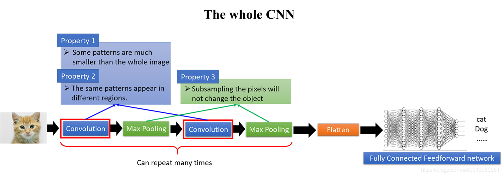

# 输入层

具有三维体积的神经元(3D volumes of neurons)：卷积神经网络利用输入是图片的特点，把神经元设计成三个维度 ： width, height, depth(注意这个depth不是神经网络的深度，而是用来描述神经元的) 。比如输入的图片大小是 7 × 7 × 3 (rgb)，那么输入神经元就也具有 7×7×3 的维度。

# 卷积层(Convolution) [另一文详解]

卷积神经网路中每层**卷积层**由若干**卷积单元**组成，每个卷积单元的参数都是通过反向传播算法优化得到的。卷积运算的目的是提取输入的不同特征，第一层卷积层可能只能提取一些低级的特征如边缘、线条和角等层级，更多层的网络能从低级特征中迭代提取更复杂的特征。

有padding，strides，dilation，transposed四种(对应下图前四个)；第五个为padding+strides，第六个为padding+strides+transposed

padding就是在外面添加一层全0像素包住当作边框

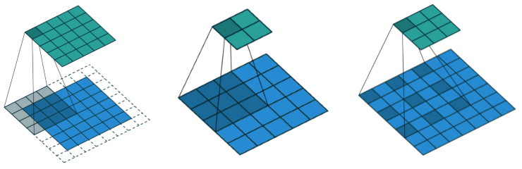

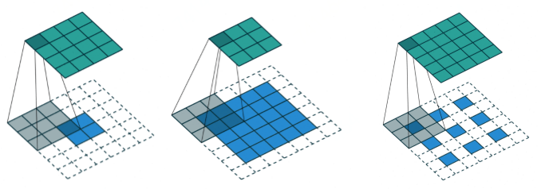

## 感受野(Receptive Field)

在卷积神经网络中，感受野(Receptive Field)的定义是卷积神经网络每一层输出的特征图(Feature Map)上的像素点在输入图片上映射的区域大小。通俗点的解释是，==特征图上的一个点对应输入图上的区域==

The receptive field is defined as the region in the input space that a particular CNN’s feature is looking at (i.e. be affected by).

卷积神经网络中，越深层的神经元看到的输入区域越大，如下图所示，kernel size 均为3×3，stride均为1

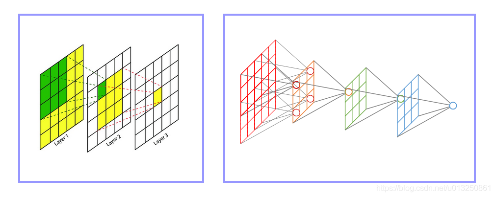

-   绿色标记的是Layer2 每个神经元看到的区域
-   黄色标记的是Layer3 看到的区域，具体地，Layer2每个神经元可看到Layer1 上 3×3 大小的区域
-   Layer3 每个神经元看到Layer2 上 3×3 大小的区域，该区域可以又看到Layer1 上 5×5 大小的区域。

所以，感受野是个相对概念，某层卷积层的特征图(Feature Map)上的元素看到前面各个不同卷积层上的区域范围是不同的，通常在不特殊指定的情况下，感受野指的是看到输入图像上的区域

# 激活函数(Active Function)

==通常使用线性整流ReLU==，线性整流层(Rectified Linear Units layer, ReLU layer)也就是使用激活函数(Active Function)的层

激活函数（activation function）运行时激活神经网络中某一部分神经元，将激活信息向后传入下一层的神经网络。神经网络之所以能解决非线性问题，本质上就是激活函数加入了非线性因素，弥补了线性模型的表达力，把“激活的神经元的特征”通过函数保留并映射到下一层。

激活函数不会更改输入数据的维度，也就是输入和输出的维度是相同的。

其实就是模仿人类神经元、==非线性变换增强特征的表达能力==、同时考虑优化时梯度消失问题 (轻轻抚摸一个人可能感觉不到，但重击一个人会有明显感觉，激活函数作相似事情，增加特征表达能力)

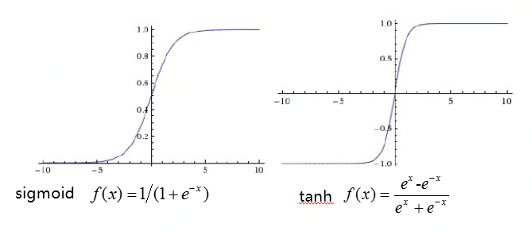

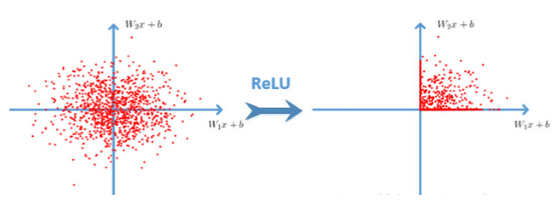

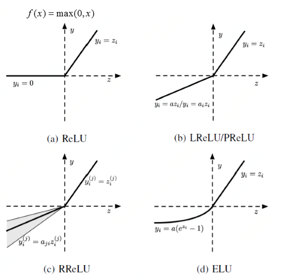

# 池化层(Pooling)

 [有去除该层的替代方案]

通常在卷积层之后会得到维度很大的特征，将特征切成几个区域，取其最大值或平均值，得到新的、维度较小的特征。

降低计算复杂度，增强特征的空间变换不变性

图像中的相邻像素倾向于具有相似的值，因此通常卷积层相邻的输出像素也具有相似的值。这意味着，卷积层输出中包含的大部分信息都是冗余的。

如果我们使用边缘检测滤波器并在某个位置找到强边缘，那么我们也可能会在距离这个像素1个偏移的位置找到相对较强的边缘。但是它们都一样是边缘，我们并没有找到任何新东西。

池化层解决了这个问题。这个网络层所做的就是通过==减小输入的大小降低输出值的数量==

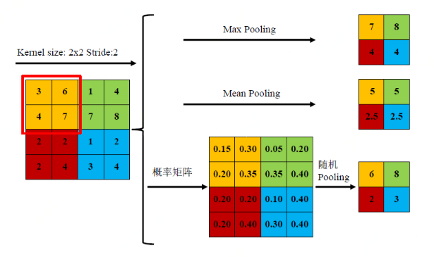

卷积网络中一个典型层包含三级，如下图所示。在第一级中，这一层并行地计算多个卷积产生一组线性激活响应。在第二级中，每一个线性激活响应将会通过一个非线性的激活函数，例如整流线性激活函数ReLU，这一级有时也被称为探测级。在第三级中，我们使用池化函数来进一步调整这一层的输出。

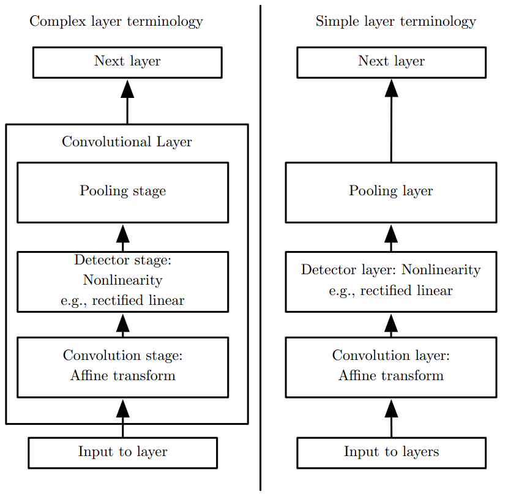

### 池化方法

池化函数使用某一位置的相邻输出的总体统计特征来代替网络在该位置的输出。例如，最大池化函数给出相邻矩形区域内的最大值。其他常用的池化函数包括相邻矩阵内的平均值、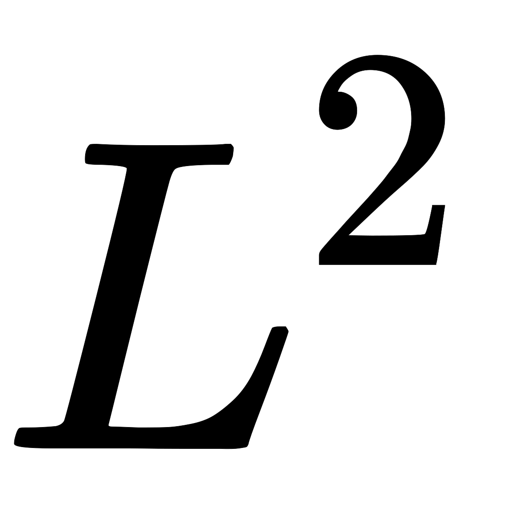范数以及基于中心像素距离的加权平均函数。

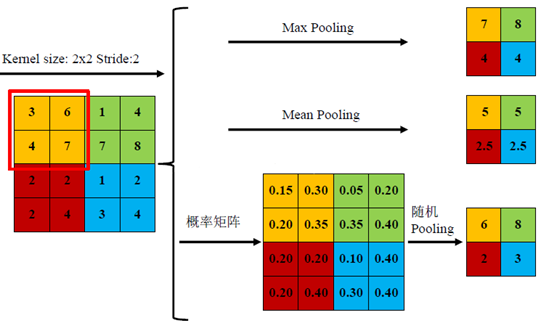

### 局部平移不变性

==不管采用什么样的池化函数，当输入作出少量平移时，池化能够帮助输入的表示近似不变==。对于平移的不变性是指当我们对输入进行少量平移时，经过池化函数后的大多数输出并不会发生改变。下图用了一个例子来说明这是如何实现的。局部平移不变性是一个很有用的性质，尤其是当我们关心某个特征是否出现而不关心它出现的具体位置时。例如，当判定一张图像中是否包含人脸时，我们并不需要知道眼睛的精确像素位置,我们只需要知道有一只眼睛在脸的左边，有一只在右边就行了。但在一些其他领域，保存特征的具体位置却很重要。例如当我们想要寻找一个由两条边相交而成的拐角时，我们就需要很好地保存边的位置来判定它们是否相交。

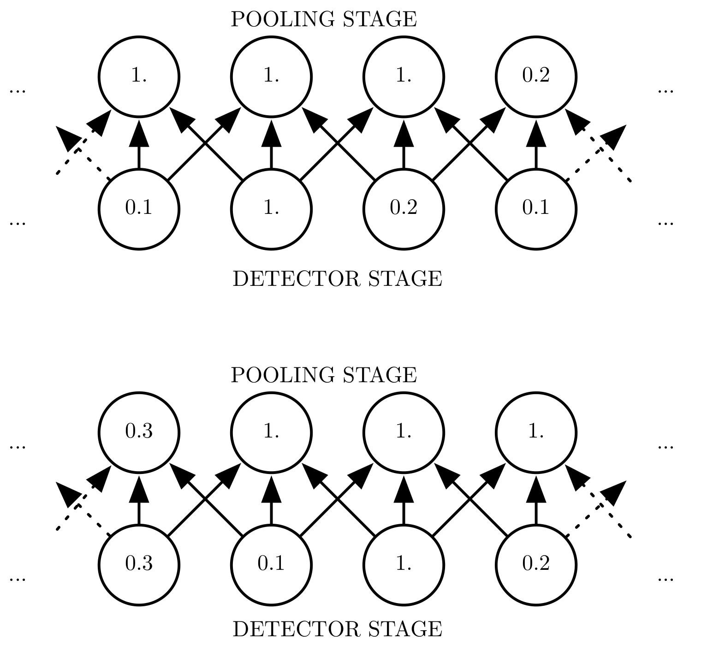

使用池化可以看作是增加了一个无限强的先验：这一层学得的函数必须具有对少量平移的不变性。当这个假设成立时，池化可以极大地提高网络的统计效率。对空间区域进行池化产生了平移不变性，但当我们对分离参数的卷积的输出进行池化时，特征能够学得应该对于哪种变换具有不变性，如下图所示

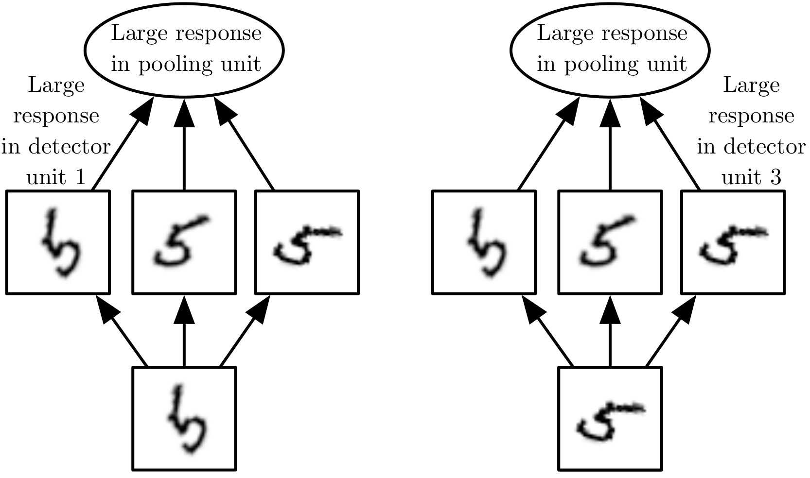

因为池化综合了全部邻居的反馈，这使得池化单元少于探测单元成为可能，我们可以通过综合池化区域的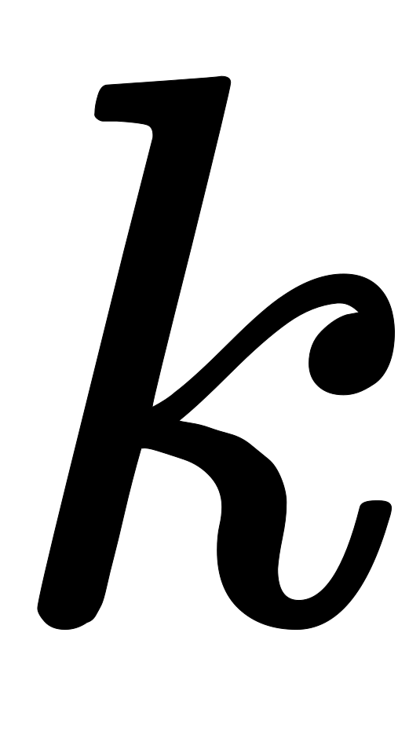个像素的统计特征而不是单个像素来实现。下图给出了一个例子。这种方法提高了网络的计算效率，因为下一层少了约倍的输入。当下一层的参数数目是关于那一层输入大小的函数时(例如当下一层是全连接的基于矩阵乘法的网络层时)，这种对于输入规模的减小也可以提高统计效率并且减少对于参数的存储需求。

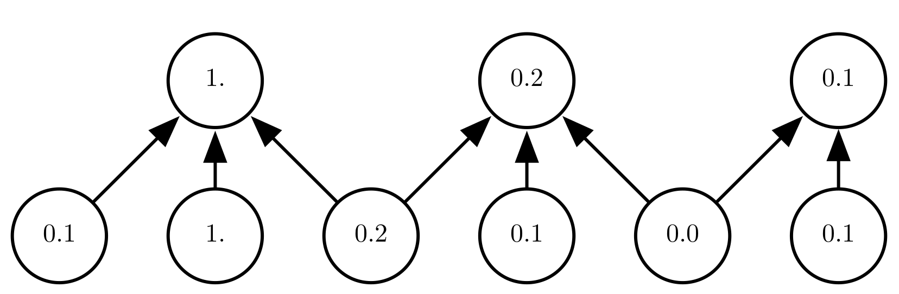

在很多任务中，池化对于处理不同大小的输入具有重要作用。例如我们想对不同大小的图像进行分类时，分类层的输入必须是固定的大小，而这通常通过调整池化区域的偏置大小来实现，这样分类层总是能接收到相同数量的统计特征而不管最初的输入大小了。例如，最终的池化层可能会输出四组综合统计特征，每组对应着图像的一个象限，而与图像的大小无关。

一些理论工作对于在不同情况下应当使用哪种池化函数给出了一些指导 (Boureau et al., 2010)。将特征一起动态地池化也是可行的，例如，对于感兴趣特征的位置运行聚类算法 (Boureau et al., 2011)。这种方法对于每幅图像产生一个不同的池化区域集合。另一种方法是先学习一个单独的池化结构，再应用到全部的图像中(Jia et al., 2012)。

卷积与池化作为一种无限强的先验。先验概率分布(prior probability distribution)的概念，这是一个模型参数的概率分布，它刻画了在我们看到数据之前我们认为什么样的模型是合理的信念。

先验被认为是强或者弱取决于先验中概率密度的集中程度。弱先验具有较高的熵值，例如方差很大的高斯分布。这样的先验允许数据对于参数的改变具有或多或少的自由性。强先验具有较低的熵值，例如方差很小的高斯分布。这样的先验在决定参数最终取值时起着更加积极的作用。

一个无限强的先验需要对一些参数的概率置零并且完全禁止对这些参数赋值,，无论数据对于这些参数的值给出了多大的支持。

我们可以把卷积网络类比成全连接网络，但对于这个全连接网络的权重有一个无限强的先验。这个无限强的先验是说一个隐藏单元的权重必须和它邻居的权重相同，但可以在空间上移动。这个先验也要求除了那些处在隐藏单元的小的空间连续的接受域内的权重以外，其余的权重都为零。总之，我们可以把卷积的使用当作是对网络中一层的参数引入了一个无限强的先验概率分布。这个先验说明了该层应该学得的函数只包含局部连接关系并且对平移具有等变性。类似的，使用池化也是一个无限强的先验：每一个单元都具有对少量平移的不变性。

当然,把卷积神经网络当作一个具有无限强先验的全连接网络来实现会导致极大的计算浪费。但把卷积神经网络想成具有无限强先验的全连接网络可以帮助我们更好地洞察卷积神经网络是如何工作的。

其中一个关键的洞察是卷积和池化可能导致欠拟合。与任何其他先验类似，卷积和池化只有当先验的假设合理且正确时才有用。如果一项任务依赖于保存精确的空间信息,那么在所有的特征上使用池化将会增大训练误差。一些卷积网络结构(Szegedy et al., 2014a)为了既获得具有较高不变性的特征又获得当平移不变性不合理时不会导致欠拟合的特征，被设计成在一些通道上使用池化而在另一些通道上不使用。当一项任务涉及到要对输入中相隔较远的信息进行合并时,那么卷积所利用的先验可能就不正确了。

另一个关键洞察是当我们比较卷积模型的统计学习表现时，只能以基准中的其他卷积模型作为比较的对象。其他不使用卷积的模型即使我们把图像中的所有像素点都置换后依然有可能进行学习。对于许多图像数据集，还有一些分别的基准，有些是针对那些具有置换不变性(permutation invariant)并且必须通过学习发现拓扑结构的模型，还有一些是针对模型设计者将空间关系的知识植入了它们的模型。

# 全连接层(Fully connected)

==全连接神经网络也叫做多层感知机（MLP）==

全连接层（full-connected layer），简称FC，是神经网络中的一种基本的结构。

仅由输入层、全连接层、输出层构成的神经网络就叫做全连接神经网络，中间的隐藏层由多层含有不同神经元的全连接层构成，结构可以看下图。

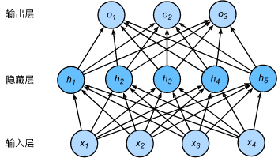

“全连接”层，顾名思义，表示==神经网络中除输入层之外的每个节点都和上一层的所有节点有连接（其实就是离散里的完全偶图）==，如下图所示:

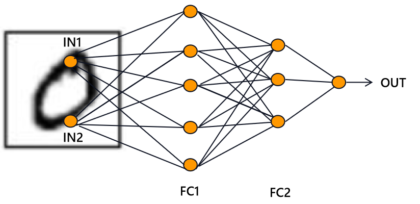

图片中IN1和IN2表示两个像素点，FC1为第一层全连接层，FC2为第二层全连接层，可以看到==全连接层所有的节点都和上一层每一个节点相连接==，最后连接输出层。当然上图只是一个简单的示例图，节点个数和层数都是随意设置的。

另外，全连接神经网络也叫做多层感知机（MLP），因为它的每一个神经元把前一层所有神经元的输出作为输入，其输出又会给下一层的每一个神经元作为输入，相邻层的每个神经元都有“连接权”。神经网络学到的东西，就蕴含在连接权和偏置中。 事实上，多层全连接的连接处理方式很好，使得全连接神经网路具备一定非线性映射学习能力，能胜任一些简单、低维度的学习任务

CNN往往最后使用softmax获得结果，全连接操作的特点：需要固定维度、参数多，计算量大，占整个网络的参数量、计算量的一半以上

softmax函数：

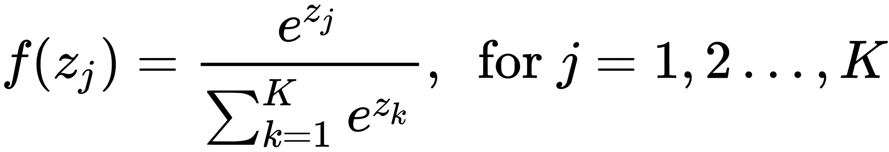

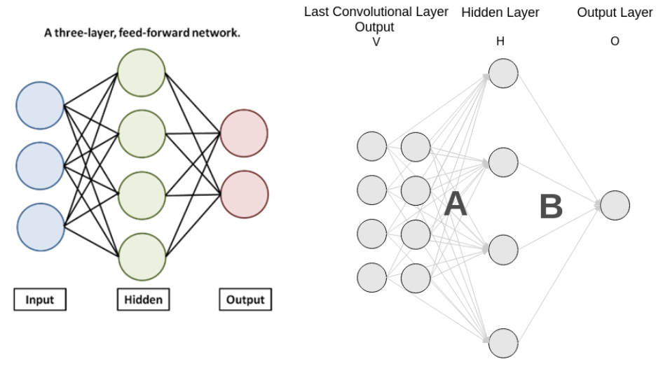